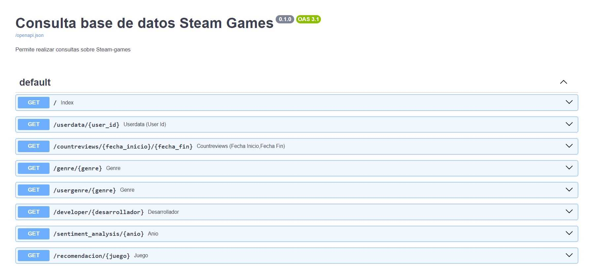

# STEAM GAMES: SISTEMA DE RECOMENDACION Y DISPONIBILIZACIÓN DE DATOS EN WEB


   
## Introducción:
Este proyecto lo realicé en el marco del trabajo individual de Henry Data Science. Para realizarlo desempeñé el rol 
de DataScientist manejando las tecnologias y herramientnas necesarias, y también aplicando el criterio para la toma de decisiones que conducen a un resultado exitoso.:muscle:

## Objetivo:
:dart: Desarrollar un sistema de recomendación de videjojuegos para plataforma Steam Games.<br>
:dart: Disponibilizar los datos de Steam Games mediante una API web para permitir su consumo desde la web.

## Planificacion del desarrollo de proyecto:


Etapas del proyecto:

1. ### [ ETL: Ingeniería de datos, extracción, exploración, transformación de datos y  desarrollo de funciones para consultas de la API.<br>](#id1)
2. Desarrollo de la API local y carga al repositorio.<br>
3. EDA: Análisis descriptivo y exploratorio previo al desarrollo del modelo de ML.<br>
4. Desarrollo del modelo de recomendación ML. <br>
5. Incorporación del modelo de recomendación a la API <br>
6. Deployment.<br>

## Punto de partida: Archivos
Contaba con tres archivos con la siguiente información:<br>
steam_games.json.gz: Contiene información descriptiva de cada ítem, como por ejemplo: precio, desarrollador, etc.<br>
users_items.json.gz: Contiene por usuario cantidad de ítems que compró, y tiempo de juego por ítem.<br>
user_reviews.json.gz: Contiene reseñas que realizaron usuarios para determinados ítems que compraron.<br>
:point_right: [Archivos crudos](https://drive.google.com/drive/folders/1HqBG2-sUkz_R3h1dZU5F2uAzpRn7BSpj)

 ##  <a name="id1"></a> 1) ETL: Extracción transformación y Carga de datos: <a name="id1"></a>
 
 
 
 
 <br>
 
#### **steam_games:**
- El archivo  steam_games tenía las columnas ('items','user_id','steam_id','items_count') que eliminé porque no estaban relacionadas con el resto de la información en el dataframe y además dicha información estaba en el archivo user_items.
- Exploré valores nulos, y eliminé aquellas filas que tuvieran valores faltantes en todas las columnas.
- Identifiqué los registros duplicados y decidí eliminarlos porque no aportan ninguna información adicional.
- La columna precio además de valores numéricos, tenía cadenas de texto indicando en algunos casos si el juego era gratis. Reemplace los valores erroneos por valores nulos, los gratuitos por 0 y los que tenían alguna referencia al precio por el precio numérico. Luego lo pase a formato float.
- La columna fecha de lanzamiento la pase a formato datetime.
- Cree una columna que con el año de la fecha de lanzamiento del juego.

#### **user_iems:**
- Este archivo presentaba la columna items anidada, como tiene información valiosa, cree una función para desanidarla.
- Luego de extraer items, analicé los nulos y eliminé solo las filas que tenían todas las columnas con valor nulo.
-  Analicé si tenia registros duplicados y luego los elimine.

#### **User_reviws:**
- Este archivo presentaba la columna reviews anidada, y como tiene información valiosa aplique la función para extraer la información.
- Analicé nulos y duplicados y los eliminé siguiendo el mismo criterio que los archivos anteriores.
- La fecha de posteo la convertí a formato datetime, y en dicha transformación se perdió informacion de fechas que no tenían año.
- Generé la columna análisis de sentimiento utilizando la librería de Python "NLTK" (Natural Language Toolkit), que para cada comentario lo etiqueta en positivo, negativo o neutro.

Terminada la limpieza de los dataframes realicé los uniones y agrupaciones necesarias de datos para poder generar los dataframes y las funciones que luego compondran el archivo main.py de la API. [Datasets](Datasets)


## 2) FAST - API :  Desarrollo de la API local.<br>

<br>
Desarrollé una API para disponibilizar los datos de la empresa a través del framework FastAPI. 
La cual contiene 6 endpoints,y se pueden ver en el archivo [main.py](main.py)

Primero construí la API de forma local configurando las funciones necesarias para realizar las consultas, y cargando la data desde los archivos  
en :point_right:[Datasets](Datasets)

**Endpoints y ejemplo de respuestas:**
* userdata( User_id : str ): Retorna cantidad de dinero gastado por el usuario, el porcentaje de recomendación en base a reviews.recommend y cantidad de items.<br>
<br>

```
{"dinero gastado": 3424.3099999999854,"porcecntaje_recom": 1.083032490974729,"cantidad_items": 277}
```
* countreviews( YYYY-MM-DD y YYYY-MM-DD : str ):  Retorna Cantidad de usuarios que realizaron reviews entre las fechas dadas y, el porcentaje de recomendación de los mismos en base a reviews.recommend.<br>
```
{"cantidad_usuarios": 517,"recomendacion": 0.9809523809523809}
```
* genre( género : str ): Retorna el puesto en el que se encuentra un género sobre el ranking de los mismos analizado bajo la columna PlayTimeForever.<br>
```
{"posicion en ranking": 1}
```
* userforgenre( género : str ): Retorna Top 5 de usuarios con más horas de juego en el género dado, con su URL (del user) y user_id.<br>
``` 
[{ "user_id": "Sp3ctre", "url": "http://steamcommunity.com/id/Sp3ctre"},
  {"user_id": "shinomegami","url": "http://steamcommunity.com/id/shinomegami" },
  { "user_id": "REBAS_AS_F-T","url": "http://steamcommunity.com/id/REBAS_AS_F-T"},
  { "user_id": "Terminally-Chill", "url": "http://steamcommunity.com/id/Terminally-Chill"},
  { "user_id": "DownSyndromeKid","url":]
```
* def developer( desarrollador : str ): Retorna la cantidad de items y porcentaje de contenido Free por año según empresa desarrolladora.<br>
```
[{ "year": 1993,"porcentaje_free": 0 },
  {"year": 1996,"porcentaje_free": 0 },
  {"year": 1997,"porcentaje_free": 0 },
  {"year": 2000,"porcentaje_free": 0}]
```
* def sentiment_analysis( año : int ): Según el año de lanzamiento, retorna una lista con la cantidad de registros de reseñas de usuarios que se encuentren categorizados con un análisis de sentimiento.<br>
```
[{"año_posted": 2012,"positivo": 830,"negativo": 140,"neutral": 231 }]
```



 ## 3. EDA: analisis descriptivo y exploratorio previa al desarrollo del modelo de ML.<br>
 
 
 
 
 <br>
 
En el análisis anterior (ETL) realicé una primera exploración de lo datos, junto con la limpieza y transformaciones necesarias para construir las primeras 6 consultas de la API. En esta instancia realicé un análisis de los datos pero, con el objetivo de explorarlos para construir a partir de los mismos el modelo de recomendación de videojuegos.<br>

Trabajé principalmente con el dataset df_steam que contenía la información de todas las características de cada videojuego. 
El EDA que realicé consta de lo siguiente:<br>

1.  :wrench: Acondicionamiento de datos: eliminar columnas con información no relevante para el modelo, imputar de valores que considero que podrían tener valor para el modelo, eliminar registros de donde el ítem estuviera duplicado.<br>
     <br>
2. :mag: Análisis de variables numéricas (distribución de datos antes y después de imputar precio, detección de outliers etc) y categóricas (cantidad de datos por categoría de cada variable categórica etc.)<br>
     <br>
3.  :bar_chart: Relación entre las características de los videojuegos y el consumo de los mismos. Para eso uní a la información de características de los videojuegos *df_steam* la información de consumo por usuario de *user_items*.De este análisis llegue a las siguientes conclusiones:<br>
      <br>
     * Tanto precio como fecha de lanzamiento no parecen tener relación con la cantidad de items vendidos de cada juego. Por lo tanto no sería una 
       variable relevante para la compra de un videojuego y por eso decido no tenerlos en cuenta en el modelo de recomendación.
            <br>
     * La cantidad de items vendidos **si** presenta una relación con el género de los mismos. Esto puede observarse en grafico de género vs cantidad de items vendidos. Se observa que de acuerdo al género se tienen diferentes consumos de juegos. Por lo tanto puedo concluir que el género 
es una variable relevante a lo hora de seleccionar un juego y la tomo como tentativa para el modelo de recomendación. Lo mismo ocurre con la columna Tags y Specs. La columna Tags contiene los géneros de los videojuegos y adicionalmente otras etiquetas. Por lo tanto la tomo en fuerte  consideración  para ser una variable contemplada en el modelo de recomendación.

## 4. MODELO DE RECOMENDACIÓN ML


 <br>
El sistema de recomendación desarrollado esta basado en contenidos (la recomendación se realiza a partir de información extraída de los ítems).
 Tipo item-item. <br>
Se ingresa el nombre de un juego y debe devolver 5 juegos similares.

Para el desarrollo del modelo  utilicé la métrica similitud del coseno (Cosine Similarity) la cual permite cuantificar la similitud entre elementos. 
Partiendo de un dataframe que contenga en las filas todos los items de videojuegos y en las columnas las características que se quieren tener en cuenta para el modelo de recomendación, Scikit Learn es capaz de calcular de una vez la similitud coseno entre todas las filas.
Del análisis EDA, pude identificar variables que considero relevantes para ser contempladas en el sistema de recomendación: Tags, Genero, Specs.
Sin embargo existe una limitación adicional relacionada con el plan desarrollador gratuito de render que ofrece 512 MB de memoria de RAM. Teniendo en cuenta la baja disponibilidad de memoria, se desarrolló un modelo de recomendación basado en las etiquetas de los videjuegos (columna:Tags).

Una vez realizado el modelo de recomendación se incorporó a la aplicación desarrollada con Fast-Api, en un séptimo endpoint.
** Endpoint y ejemplo de respuesta:**

* recomendacion_juego( id de producto ): Ingresando el id de producto, retorna una lista con 5 juegos recomendados similares al ingresado.
```
["GRACE OF ZORDAN", "THE BANNER SAGA: FACTIONS","TACTICAL GENIUS ONLINE", "INFINITY WARS: ANIMATED TRADING CARD GAME","CHRONICLE: RUNESCAPE LEGENDS"]
```

## 5. DEPLOYMENT DE LA APLICACION CON FUNCIONES Y SISTEMA DE RECOMENDACIÓN


Para hacer el despliegue de las funciones de la API que incluyen las consultas así como el sistema de recomendación de videoJuegos se utilizó Render. 
Render toma el código del repositorio  y lo implementa en sus servidores.
[Link a la APP web](https://api-steam-deploy.onrender.com/docs#/)


